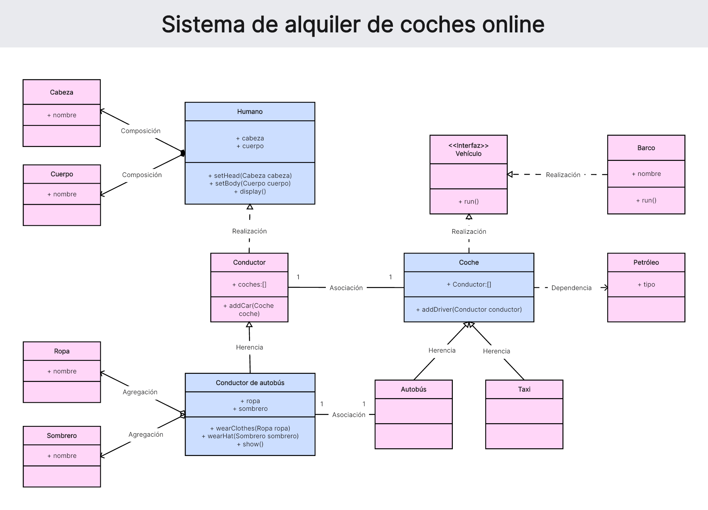

# Microservicio de Alquiler de Coches - Spring Boot 3 con Java 17 y MySQL

Este proyecto es un ejercicio de aprendizaje para desarrollar un microservicio de alquiler de coches utilizando Spring Boot 3, Java 17 y MySQL. El objetivo principal es practicar y demostrar mis habilidades en el desarrollo de microservicios, la persistencia de datos con Hibernate y el uso de las últimas características de Java.

## Descripción

Este microservicio permite gestionar el alquiler de coches, incluyendo:

* **Gestión de clientes:** Registro, modificación y consulta de información de clientes.
* **Gestión de vehículos:** Registro, modificación y consulta de información de vehículos disponibles.
* **Gestión de alquileres:** Registro, modificación y consulta de alquileres, incluyendo la asignación de vehículos a clientes.
* **Consulta de disponibilidad:** Permite a los clientes consultar la disponibilidad de vehículos por fechas.
* **Implementación de las relaciones y clases definidas en el diagrama UML proporcionado.**

El proyecto sigue el diagrama UML proporcionado como guía para la implementación de las clases y relaciones entre ellas.

## Diagrama UML

## Stack Tecnológico

* **Lenguaje:** Java 17
* **Framework:** Spring Boot 3
* **Base de datos:** MySQL
* **Persistencia:** Hibernate 

## Funcionalidades Principales

* Endpoints REST para la gestión de clientes, vehículos y alquileres.
* Persistencia de datos en MySQL utilizando Hibernate.
* Manejo de excepciones y validaciones.
* Implementación de patrones de diseño (DAO, DTO, etc.).
* Implementación de las relaciones definidas en el UML, como composición, agregación, herencia, asociación, realización y dependencia.

## Patrones de Diseño

* **DAO (Data Access Object):** Para la capa de acceso a datos.
* **DTO (Data Transfer Object):** Para la transferencia de datos entre capas.
* **Implementación de las relaciones del UML:** Se han implementado las relaciones de composición, agregación, herencia, asociación, realización y dependencia según el diagrama UML proporcionado.

## Próximos Pasos

* Implementar pruebas unitarias y de integración.
* Agregar autenticación y autorización.
* Mejorar la interfaz de usuario (si se incluye una).
* Documentar la API con Swagger o OpenAPI.
* Implementar servicios para la generación de informes y estadísticas.

## Autor

[samantonio91] ((https://github.com/samantonio91))

## Contacto

[sam.antonio.91@gmail.com]